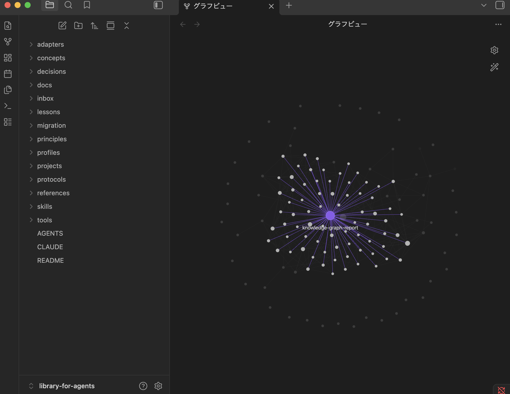

# Portable Agent Brain

English | [日本語](README.ja.md)

Even while using Hermes-agent, I keep trying different AIs and moving between
them. Losing the knowledge I'd built up each time I switched was frustrating,
so I made this.

I want to try another AI without starting that part over. This keeps knowledge
in Markdown files outside the agent, so the next agent can read it too.

## Setup: paste this into your AI

You're probably not going to read a long explanation anyway, so paste this into
the AI you want to use. It is a chat message, not a command for Terminal.

```text
Set up Portable Agent Brain and turn useful findings from my past chats and
work history into notes that I can carry over to another AI.

https://github.com/nennchakki/portable-agent-brain

Read prompts/setup-and-import.md in the repository and follow
"Instructions for the AI doing the setup."

Add a reference to the shared instruction file in the settings you normally read.
Ask me which history you may use, then continue through saving the first notes.
Link the notes so I can explore their connections in Obsidian too.
Keep explanations short. At the end, tell me what is done and what I need to do.
```

This is for an AI that can read and write files and run commands. Where it cannot
act, it should explain the steps you need to take.
[Japanese prompt](README.ja.md#セットアップaiにこれを貼る) ·
[Full instructions for the AI](prompts/setup-and-import.md)

### Prefer to set it up yourself?

You'll need macOS or Linux, Python 3.11 or newer, and Git.

```sh
git clone https://github.com/nennchakki/portable-agent-brain.git
cd portable-agent-brain
./brain setup
```

Answer the prompts to choose where to keep your knowledge and which agents to
connect. Claude Code and Codex can be set up here. For other agents, see the
[integration guide](docs/agent-integration.md).

You start with an empty notes folder. Save short notes about what you learned,
and let the next AI read only the notes relevant to its work.



An example with existing notes in Obsidian. A new library starts empty.

## A few things worth knowing

- Knowledge stays in a separate local folder. This public repository contains
  none of my personal knowledge or conversation history.
- Git synchronization is optional. Use a private repository if you want a backup.
- Saved notes are for reference until a person reviews them. The AI does not
  turn them into rules for future work on its own.
- The CLI does not import past conversations. `--history-source` only returns
  guidance. With the prompt above, the AI reads and summarizes history you approve.

For more detail, read the [beginner setup and usage guide](docs/guide.md) or the
[features and commands guide](docs/features.md). The latter also explains
[how this differs from Hermes-Agent](docs/features.md#hermes-agent-and-portable-agent-brain).
Both guides have Japanese versions.

Questions and bugs can go in [Issues](https://github.com/nennchakki/portable-agent-brain/issues).
Please don't paste secrets or actual conversation logs there.

[MIT License](LICENSE)
